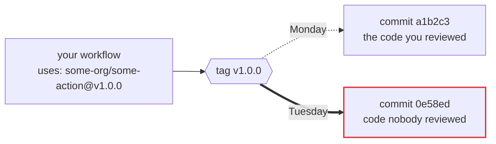

# Refledger

**Live site:** [refledger.gautamkhosla.com](https://refledger.gautamkhosla.com)

**What did `v4` point at last Tuesday? Refledger remembers.**

Your workflow says this:

```yaml
uses: some-org/some-action@v4
```

That looks like a version. It is not. It is a pointer, and whoever controls that repository can aim it at completely different code tonight. Your workflow file will not change. Your diff will not show anything. The next run just executes whatever `v4` means now.

And here is the part almost nobody knows: **when a tag moves, GitHub keeps no record of where it used to point.** The old value is simply gone.

Refledger writes it down. It watches GitHub Action tags, records what every tag pointed at and when it moved, and signs that record so nobody (including us) can quietly rewrite it later.



Same label. Different code. No trace. Unless someone was watching.

---

## This has already happened. Twice, at scale.

**March 2025, `tj-actions/changed-files`.** An attacker moved nearly all of its version tags to a single malicious commit. Every pipeline using any of them started printing its own secrets into build logs. ([StepSecurity write-up](https://www.stepsecurity.io/blog/harden-runner-detection-tj-actions-changed-files-action-is-compromised); [CVE-2025-30066](https://github.com/advisories/GHSA-mrrh-fwg8-r2c3). Neither source states an exact tag count.)

**March 2026, `aquasecurity/trivy-action`.** Per [GHSA-69fq-xp46-6x23](https://github.com/aquasecurity/trivy/security/advisories/GHSA-69fq-xp46-6x23), an attacker force-pushed 76 of 77 version tags to credential-stealing malware, and replaced all 7 tags of `aquasecurity/setup-trivy`. The same advisory notes that SHA-pinning `trivy-action` to a commit from before 2025-04-09 could still pull a malicious `setup-trivy` by tag. Pinning the top of the tree does not pin the rest of it.

Both attacks share a shape: many old, stable, *exact* version tags moving together to one commit. Legitimate release engineering never does that. Refledger looks for exactly that shape.

---

## What Refledger is

**An observatory.** A poller checks every watched action's tags on a fixed schedule and records each observation, including the boring ones where nothing changed and the failed ones where GitHub said no. Quiet days are evidence too.

**A ledger.** Every movement becomes an entry in an append only, hash chained log. Each entry names the one before it. Change a single byte anywhere and the chain breaks at that exact spot.

**A witness.** Once a day the day's ObservationDigest is signed with Ed25519, appended to `heads.jsonl`, submitted to [Sigstore's Rekor](https://docs.sigstore.dev/logging/overview/), and fast-forward pushed to the public repository so `git clone` carries the ledger. We cannot rewrite yesterday even if we wanted to.

**Reproducible.** From the same raw observations, two independent runs of classify → enrich → derive → append produce identical ledger bytes. That is what `replay_observe_classify_derive_chain_is_byte_for_byte` in `crates/refledger-poller/tests/derive.rs` proves. You do not have to trust our published log; you can rebuild from the observations on the `data` branch and compare.

## What Refledger is not

It does not tell you an action is "safe" or "compromised". It tells you what moved, when we saw it, and what changed. Most tag movement is completely legitimate: GitHub's own guidance tells maintainers to move major version tags like `v4` forward with every release. Refledger records facts and leaves the verdicts to you.

It is not the only tag monitor out there, either. Commercial tools watch tags privately for their customers. Refledger's point is different: the record is **public, free, and independently verifiable.**

---

## Where things stand

| | |
|---|---|
| **Stage** | Watching started **29 September 2026**. The seven-day M1 measurement window seals at **10 October 2026** (`2026-10-10T00:00:00Z`). Code on `main` is frozen for that window ([`FREEZE.md`](FREEZE.md)). |
| **Watching** | 38 action keys across 35 repositories, plus a canary we control (36 poll groups) |
| **Poll rate** | every 5 minutes at `:02`, `:07`, … via Cloudflare Worker `refledger-clock` (Actions `schedule` as backup). Same cadence in [`OPERATIONS.md`](OPERATIONS.md). |
| **Public site** | [refledger.gautamkhosla.com](https://refledger.gautamkhosla.com) |

The population is deliberately small and honestly defined: a set of cited seed actions plus everything those actions pull in through their own `action.yml` files, at every tag. See [`population/METHOD.md`](population/METHOD.md).

**Freeze note:** Code on `main` is frozen (per [`FREEZE.md`](FREEZE.md)) from 2026-10-03T00:00:00Z through the 2026-10-10 seal. Only markdown documentation may change during this window. The freeze ensures the poller, log format, and signatures remain the same instrument throughout the M1 measurement period (2026-10-03 through 2026-10-09).

---

## Check our work

You should not have to take our word for anything. Pin the published signing key (`docs/PUBLIC-KEY.md`):

```bash
git clone https://github.com/GautamTalksDev/refledger.git
cd refledger
cargo run --locked --release -p refledger-verify -- data/log --strict \
  --pubkey b3e7e795c35dee53731e039b76da930fc54e87e2edc632449a8a2e55252e276a
```

That is the same command shown on the site's [Verify](https://refledger.gautamkhosla.com/verify) page. A fresh clone of `main` has `data/log/` with day files and `heads.jsonl`. See [`docs/VERIFY.md`](docs/VERIFY.md) for verifying the in-progress chain on the `data` branch (no `--strict` until heads exist).

The verifier shares no code with the signer, on purpose.

---

## Read more

| Document | What's in it |
|---|---|
| [How it works](docs/HOW-IT-WORKS.md) | The full pipeline, from a single HTTP request to a signed, witnessed entry |
| [Verify the ledger](docs/VERIFY.md) | Every check the verifier runs, and why it is built independently |
| [Log format](docs/LOG-FORMAT.md) | The normative byte level specification |
| [Rekor witnessing](docs/REKOR.md) | How daily heads are submitted to Sigstore's public log |
| [Crawler policy](OPERATIONS.md) | What we request from GitHub, how often, and how we back off |
| [Security](SECURITY.md) | How to report a bug, and what we do when we spot something live |
| [Incidents](https://refledger.gautamkhosla.com/incidents) | Public summaries of every disclosed mistake (source: [`docs/incident-summaries.md`](docs/incident-summaries.md)) |
| [Kill test](KILL-TEST.md) | The public, pre registered condition under which this project shuts down |
| [Freeze](FREEZE.md) | Code freeze on `main` for the seven-day run |

---

## Repository map

```
crates/
  refledger-log/      entries, canonical JSON, hash chain, signing
  refledger-verify/   the independent verifier (shares no code with the above)
  refledger-poller/   observe, resolve, classify, derive, store, schedule
clock/                Cloudflare Worker that dispatches poll.yml
tests/vectors/        conformance vectors both implementations must reproduce
population/           what we watch, and exactly why
data/log/             sealed ledger on main (after first seal); day files + heads
docs/                 everything you would want to read
```

Live observations and the in-progress day log are on the **`data` branch** (directories `observations/` and `log/`). Canary (deliberate tag moves for detection measurement): [GautamTalksDev/canary](https://github.com/GautamTalksDev/canary).

## Privacy

The public site at [refledger.gautamkhosla.com](https://refledger.gautamkhosla.com) collects nothing from visitors. Checks run in the browser against GitHub's API. The append-only ledger stores public repository facts (tag names, commit hashes, times), not personal data from taggers or authors. Site policy: [/privacy](https://refledger.gautamkhosla.com/privacy).

## Security

Report vulnerabilities in Refledger via [GitHub private vulnerability reporting](https://github.com/GautamTalksDev/refledger/security/advisories/new). Operator response policy for observed attacks is in [`SECURITY.md`](SECURITY.md). Public summary: [/security](https://refledger.gautamkhosla.com/security); machine-readable contact at [/.well-known/security.txt](https://refledger.gautamkhosla.com/.well-known/security.txt).

## License

Code is Apache 2.0. See [`LICENSE`](LICENSE). The same text is also in [`LICENSE-APACHE`](LICENSE-APACHE).

Ledger data is dedicated to the public domain under [`DATA-LICENSE`](DATA-LICENSE) (CC0 1.0). Ledger data: CC0, public domain.
