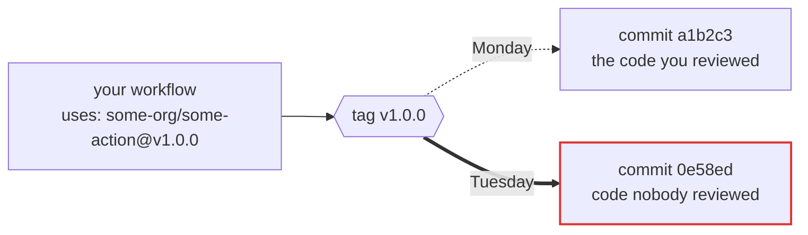

# Refledger

**What did `v4` point at last Tuesday? Refledger remembers.**

Your workflow says this:

```yaml
uses: some-org/some-action@v4
```

That looks like a version. It isn't. It's a pointer, and whoever controls that repository can aim it at completely different code tonight. Your workflow file won't change. Your diff won't show anything. The next run just executes whatever `v4` means now.

And here's the part almost nobody knows: **when a tag moves, GitHub keeps no record of where it used to point.** The old value is simply gone.

Refledger writes it down. It watches GitHub Action tags, records what every tag pointed at and when it moved, and signs that record so nobody (including us) can quietly rewrite it later.



Same label. Different code. No trace. Unless someone was watching.

---

## This has already happened. Twice, at scale.

**March 2025, `tj-actions/changed-files`.** An attacker repointed 346 existing version tags at a single malicious commit. Every pipeline using any of them started printing its own secrets into build logs. Most of those tags had been stable for over 148 days. They looked about as trustworthy as a tag can look.

**March 2026, `aquasecurity/trivy-action`.** 76 of 77 version tags were force pushed to a credential stealer, alongside every tag of `setup-trivy`. One team was correctly SHA pinned to `trivy-action` and got hit anyway, because `trivy-action` itself referenced `setup-trivy` by tag. Pinning the top of the tree does not pin the rest of it.

Both attacks share a shape: many old, stable, *exact* version tags moving together to one commit. Legitimate release engineering never does that. Refledger looks for exactly that shape.

---

## What Refledger is

**An observatory.** A poller checks every watched action's tags on a fixed schedule and records each observation, including the boring ones where nothing changed and the failed ones where GitHub said no. Quiet days are evidence too.

**A ledger.** Every movement becomes an entry in an append only, hash chained log. Each entry names the one before it. Change a single byte anywhere and the chain breaks at that exact spot.

**A witness.** Once a day the day's ObservationDigest is signed with Ed25519, appended to `heads.jsonl`, and submitted to [Sigstore's Rekor](https://docs.sigstore.dev/logging/overview/), a public transparency log we don't control. We can't rewrite yesterday even if we wanted to.

**Reproducible.** Give anyone the raw observation archive and they can regenerate the entire ledger byte for byte. You don't have to trust our log. You can rebuild it.

## What Refledger is not

It doesn't tell you an action is "safe" or "compromised". It tells you what moved, when we saw it, and what changed. Most tag movement is completely legitimate: GitHub's own guidance tells maintainers to move major version tags like `v4` forward with every release. Refledger records facts and leaves the verdicts to you.

It isn't the only tag monitor out there, either. Commercial tools watch tags privately for their customers. Refledger's point is different: the record is **public, free, and independently verifiable.**

---

## Where things stand

| | |
|---|---|
| **Stage** | M1: the observatory is built and entering its first continuous run |
| **Watching** | 38 action keys across 35 repositories, plus a canary we control |
| **Poll rate** | every 60 seconds per repository |
| **Public site** | coming at `refledger.gautamkhosla.com` |

The population is deliberately small and honestly defined: a set of cited seed actions plus everything those actions pull in through their own `action.yml` files, at every tag. See [`population/METHOD.md`](population/METHOD.md).

---

## Check our work in 60 seconds

You shouldn't have to take our word for anything. Clone the repo and run the verifier:

```bash
git clone https://github.com/GautamTalksDev/refledger.git
cd refledger
cargo run --release -p refledger-verify -- data/log --strict
```

It replays the whole chain, checks every signed head, and tells you in five lines whether the record is intact. The verifier shares no code with the signer, on purpose. Full walkthrough in [`docs/VERIFY.md`](docs/VERIFY.md).

---

## Read more

| Document | What's in it |
|---|---|
| [How it works](docs/HOW-IT-WORKS.md) | The full pipeline, from a single HTTP request to a signed, witnessed entry |
| [Verify the ledger](docs/VERIFY.md) | Every check the verifier runs, and why it's built independently |
| [Log format](docs/LOG-FORMAT.md) | The normative byte level specification |
| [Rekor witnessing](docs/REKOR.md) | How daily heads are submitted to Sigstore's public log |
| [Crawler policy](OPERATIONS.md) | What we request from GitHub, how often, and how we back off |
| [Security](SECURITY.md) | How to report a bug, and what we do when we spot something live |
| [Kill test](KILL-TEST.md) | The public, pre registered condition under which this project shuts down |

---

## Repository map

```
crates/
  refledger-log/      entries, canonical JSON, hash chain, signing
  refledger-verify/   the independent verifier (shares no code with the above)
  refledger-poller/   observe, resolve, classify, derive, store, schedule
tests/vectors/        conformance vectors both implementations must reproduce
population/           what we watch, and exactly why
data/log/             the ledger itself, one file per UTC day, plus signed heads
docs/                 everything you'd want to read
```

Canary (deliberate tag moves for detection measurement): [GautamTalksDev/canary](https://github.com/GautamTalksDev/canary).
## License

Code is Apache 2.0. See [`LICENSE-APACHE`](LICENSE-APACHE).
