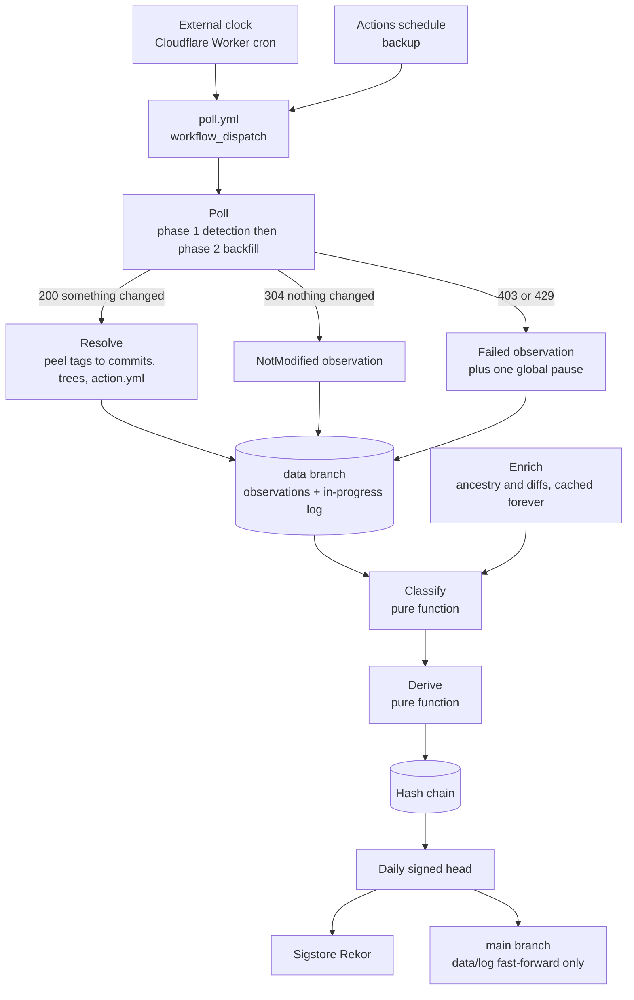
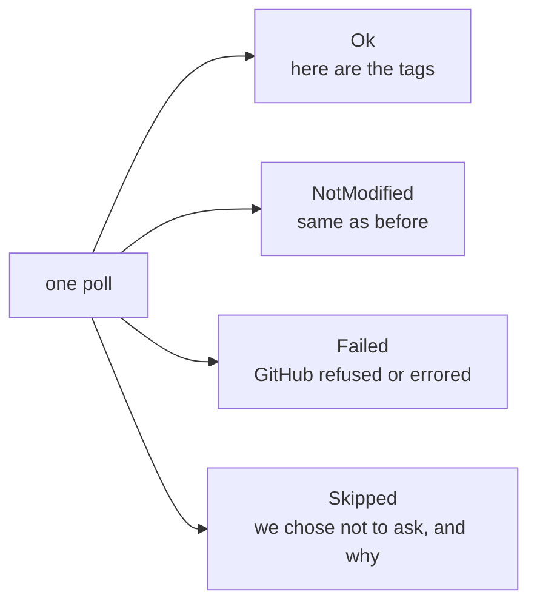
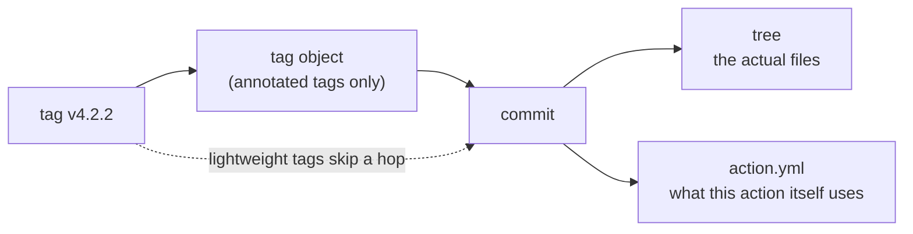
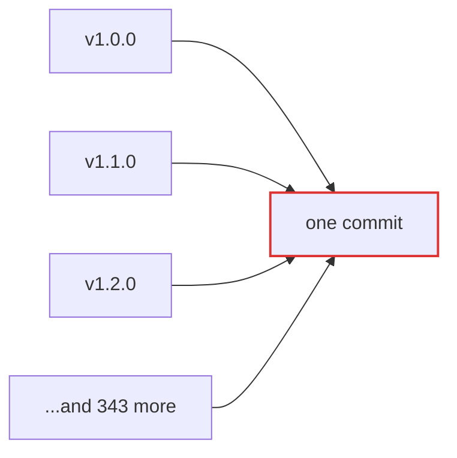
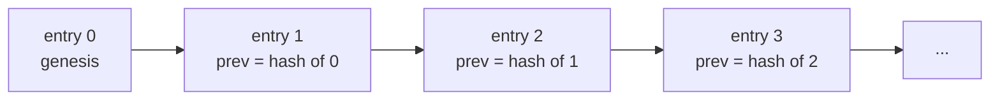
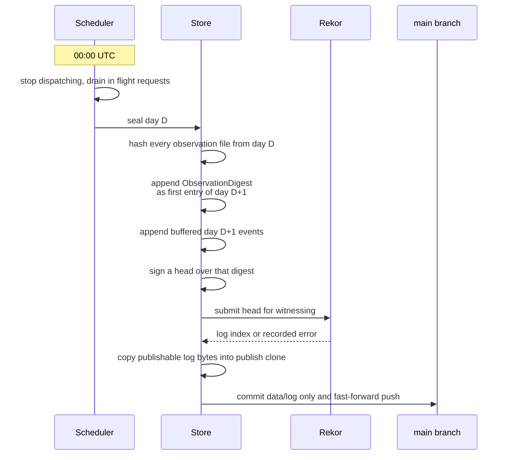

# How Refledger works

From one HTTP request to a signed, publicly witnessed fact. This is the whole machine, stage by stage.

Two design rules run through everything below:

1. **Record the boring stuff.** Unchanged polls, failed polls and skipped polls are all written down. A tag being stable for 148 days is only a claim if you can show the 148 days of observations.
2. **Keep the thinking pure.** Classification and derivation never touch the network or the clock. That is what makes the whole ledger reproducible from the raw observations.

---

## 1. Poll: asking GitHub cheaply, on a fixed schedule

Every 5 minutes an external Cloudflare Worker clock (`clock/`, Worker name
`refledger-clock`) POSTs `workflow_dispatch` for the poll workflow. The workflow
still lists a matching `schedule` cron as backup. Either path starts one
sweep over all **36 poll groups** (35 ecosystem repositories plus the canary).

The schedule uses off minutes (`:02`, `:07`, `:12`, … `:57`), never `:00`, because GitHub warns that scheduled jobs can be delayed under load at the top of the hour. Each run records when it was supposed to start and when it actually started, so schedule lag is measured data rather than a guess.

Each run is split into two phases (detection before backfill):

| Phase | Work | Budget |
|---|---|---|
| **1** | Conditional repo metadata + conditional tag listing for every poll group | Always first |
| **2** | Object peels, `action.yml` / compare, warm-up | Whatever remains of the per-run caps |

When a sweep sees a tag move, it re-polls that repository about 60 seconds later in the same short job and records both observations. That catches flickers such as create, delete, recreate that a single look would miss.

It asks with the `ETag` from last time. If nothing changed, GitHub answers `304 Not Modified` with an empty body. That answer is almost free against the hourly request budget when the request is authenticated. Reads use a **stable read-only fine-grained PAT** (`REFLEDGER_GITHUB_TOKEN`) so ETags survive across runs. Pushes use the job `GITHUB_TOKEN`. Live 304 versus 200 counts are logged every run (`docs/CALIBRATION.md`).

"Almost" is doing real work in that sentence. GitHub also enforces **secondary limits**, and a 304 still costs one point there. Those limits have no header, so you cannot see how close you are. You only find out by being refused. So Refledger:

* runs a single points governor over *every* request it makes, capped at a third of GitHub's documented ceiling (300 points/minute)
* caps each Actions run at **300** requests and **120** new peels, with phase 1 always preferred over warm-up
* treats any refusal as one global pause, not a stampede of retries
* writes every refusal down as an observation, so the gap is visible in the data

At today's population a warm sweep is typically about 72 conditional requests, nearly all 304s, well under the PAT hourly budget of 5,000.

### Every poll becomes an observation

Skipped observations carry a reason: budget exhausted, backing off after a refusal, scheduler running late (with scheduled vs actual start times), shutting down, or the poller simply was not running (recorded on restart as `PollerDown`). A gap is always a record, never a silence.

Observations and the in-progress day log are committed publicly on the **`data` branch** after each run. There is no object-store mirror.

---

## 2. Resolve: turning names into content

A tag name points at an object. Refledger follows it all the way down:

Here is the trick that keeps this affordable: **git objects never change.** A commit hash always means the same commit. So every lookup from object to commit to tree is cached forever, with no expiry. Only the *tag to target* binding ever moves, and that is the one thing we poll for. A second sweep over unchanged tags costs zero extra requests.

`action.yml` is always fetched at the exact commit, never by tag name, so a tag moving mid request cannot give us the wrong file.

---

## 3. Classify: what kind of move was that?

When a tag's target changes, Refledger compares the old and new at three depths:

| What differs | Classification | In plain words |
|---|---|---|
| The files | **Content change** | Different code runs now |
| The commit, not the files | **Commit metadata only** | History was rewritten, code is identical |
| Only the tag itself | **Release level only** | Re tagged, same commit, e.g. lightweight to annotated |

### The rule that actually separates attacks from maintenance

You might think "a tag that was stable for months suddenly moved" is the red flag. It is not. Under GitHub's own convention, `v4` sits still for months and then moves forward on every release. That is the normal case. Flag it and you would drown in false alarms.

The real signal is the **shape of the tag name**:

| Form | Examples | Supposed to move? |
|---|---|---|
| Floating major | `v4` | Yes, forward, on every release |
| Floating minor | `v4.2` | Yes, forward |
| Exact | `v4.2.2`, `v1.0.0-rc.1` | **Never** |
| Named channel | `main`, `latest` | Constantly |

And for floating tags, the second signal is **direction**. A floating tag moving to a newer commit that builds on the old one is maintenance. Moving backwards, or sideways onto unrelated history, is not.

### Severity

| Severity | When |
|---|---|
| **High** | An exact tag's content changes. A floating tag moves backwards or sideways. Any batch correlation. |
| **Medium** | An exact tag's commit metadata changes. A deleted tag comes back pointing somewhere new. |
| **Low** | A floating tag moves forward to new code: an ordinary release. |
| **Info** | Release level only changes, named channel moves, deletions. |

A routine `v4` release is Low no matter how long `v4` sat still. A single exact tag content change is High.

### Correlation: the attack signature

When three or more **pre existing exact** tags in one repository move to the **same** commit within a 30 minute window, Refledger emits a correlation. That is the tj-actions shape and the Trivy shape. A normal release, where `v4` and `v4.2` jump to the commit that `v4.2.3` was just created on, does not trigger it, because new tags and floating tags do not count.

### Deleted, then back

A tag that disappears and later reappears is not a new tag. Refledger keeps a tombstone for every deleted tag, indefinitely, and records the return as a single *recreation* carrying the gap and both bindings. Its stability history does not reset.

---

## 4. Derive and chain: facts become ledger entries

Classified events are turned into ledger entries by another pure function. Every entry carries `format_version: 1`. Move, deletion and recreation entries also:

* name at least two source observations (a move needs a before and an after)
* take their timestamp from the observation that detected them, never the wall clock
* state an **observation window**: we can only know a tag moved *between* two polls, never the exact second, and those entries say so

Entries are serialised as canonical JSON (sorted keys, no floats, no nulls, fixed timestamp precision), hashed with SHA 256, and linked:

Entries are never edited. A mistake gets a new *correction* entry that points at the old one, and the old one stays in the chain.

Correlations that build up across several polls cannot be written as one entry after the fact. So the individual moves are logged as they happen, and a separate correlation entry is appended once the pattern is clear, pointing back at them.

---

## 5. The daily seal

Once a day, at midnight UTC, the day gets closed and signed:

The Ed25519 signing key is available only as Environment secret `REFLEDGER_SIGNING_KEY` on the GitHub Environment named `ledger` (main branch only). It is never a repository-level secret.

The **ObservationDigest** is the clever bit. Observations are far too numerous to chain one by one, so instead each day's digest records the hash of every observation file plus counts of ok, not modified, failed and skipped polls. That puts the raw evidence under the signature. Every stability claim in the ledger now traces to signed data.

A day with zero observations still gets a digest, with zeros in it. A missing day and a quiet day must never look the same.

Until the first seal lands, the public `main` clone has no `data/log/` yet. The in-progress chain is on the `data` branch under `log/`. Poller state (warnings, publish failures) lives under `state/` on that branch, not under `log/`. See [`VERIFY.md`](VERIFY.md).

---

## 6. Three witnesses

| Witness | What it protects against |
|---|---|
| **The hash chain** | Editing, deleting or reordering any entry |
| **Public git history** | Rewriting the chain and re signing it quietly. Each sealed day is fast-forward pushed to `GautamTalksDev/refledger` under `data/log/` on `main`; force pushes are forbidden |
| **Sigstore Rekor** | Rewriting git too. Rekor is a public log we do not control |

A head that goes more than 48 hours without a Rekor witness is noted in the next digest and fails `refledger-verify --strict`.

---

## 7. Knowing it works: the canary

A week of silence from well behaved actions would prove nothing. So Refledger watches a repository we control, [`canary`](https://github.com/GautamTalksDev/canary), whose tags get moved on purpose, on a schedule, in every pattern above: forward releases, exact tag changes, rewritten commits, delete and recreate, and a full batch attack shape.

Each deliberate move is logged in the canary's own ledger. Joining that ground truth against the Refledger chain gives a real, measured detection latency, published in [`DETECTION.md`](DETECTION.md). Few monitors publish that number. This one does.

---

## 8. Honest limits

* **Timing is a window.** We know a tag moved between two polls, roughly a minute apart, not the exact moment.
* **Coverage is a defined population.** We watch what is in [`population/`](../population/), not all of GitHub, and we say exactly what that is.
* **Restarts leave gaps.** They are recorded, never hidden.
* **We report, we do not judge.** Refledger will never call an action safe or compromised.
* **Code on `main` is frozen** for seven days from the first clean seal (`FREEZE.md`). Docs may still change.
